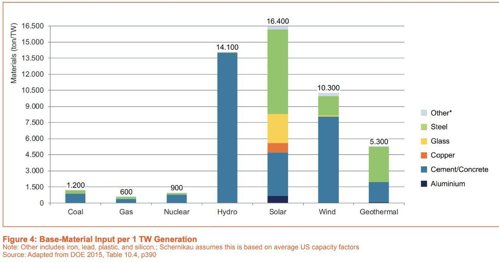
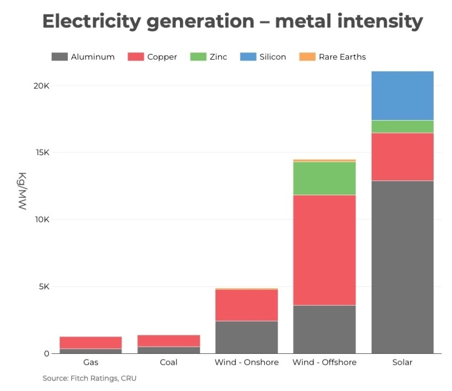



<object data="https://undeaddemidov.github.io/realeconhugo/static/pdf/energy/Weissbach_EROI_preprint.pdf" type="application/pdf" width="700px" height="700px">
    <embed src="https://undeaddemidov.github.io/realeconhugo/static/pdf/energy/Weissbach_EROI_preprint.pdf">
        
This browser does not support PDFs. Please download the PDF to view it: <a href="https://undeaddemidov.github.io/realeconhugo/static/pdf/energy/Weissbach_EROI_preprint.pdf">Download PDF</a>.

    </embed>
</object>